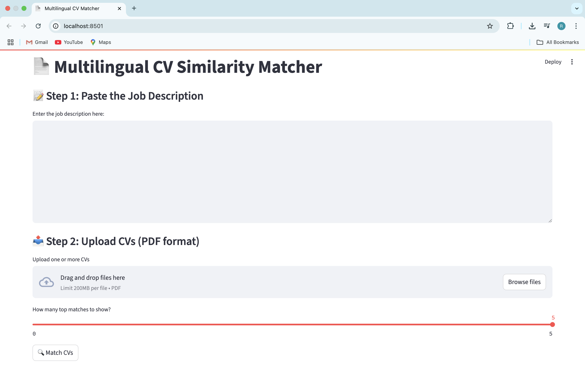

# 🌍 ResumeMatcher\_multilingual

A multilingual, domain-agnostic semantic search engine that matches candidate CVs (PDFs) to any job description using state-of-the-art transformer embeddings and FAISS vector search.


---

## 🔍 What It Does

This tool ranks and retrieves the most relevant CVs for a given job description—regardless of role, language, or domain.

* ✅ Supports **100+ languages**  
* ✅ Uses **chunked CV search** for higher semantic resolution  
* ✅ Offers both **Streamlit UI** and **terminal CLI**  
* ✅ Works across unrelated domains (e.g., tech vs hospitality)  
* ✅ Powered by **BAAI/bge-m3** — a cutting-edge multilingual retrieval model
---

## 📦 Project Structure

```bash
ResumeMatcher_multilingual/
├── main.py              # CLI interface
├── app.py               # Streamlit web app
├── jds/                 # Job descriptions (.txt)
├── cvs/                 # CVs (.pdf)
├── requirements.txt     # Dependencies
└── README.md
```

---

## ⚙️ Supported Embedding Model

This project uses the [`BAAI/bge-m3`](https://huggingface.co/BAAI/bge-m3) model — a state-of-the-art multilingual embedding model optimized for dense retrieval tasks across 100+ languages.

---

## 🚀 Usage

### ▶️ Command-line (CLI)

```bash
python main.py --jd_file ./jds/software_engineer.txt --cv_folder ./cvs 
```

### 💻 Streamlit Web App


```bash
streamlit run app.py
```

Then open your browser at: [http://localhost:8501](http://localhost:8501)

#### Streamlit UI Preview



---

## 🔧 Installation
```bash
pip install -r requirements.txt
```

